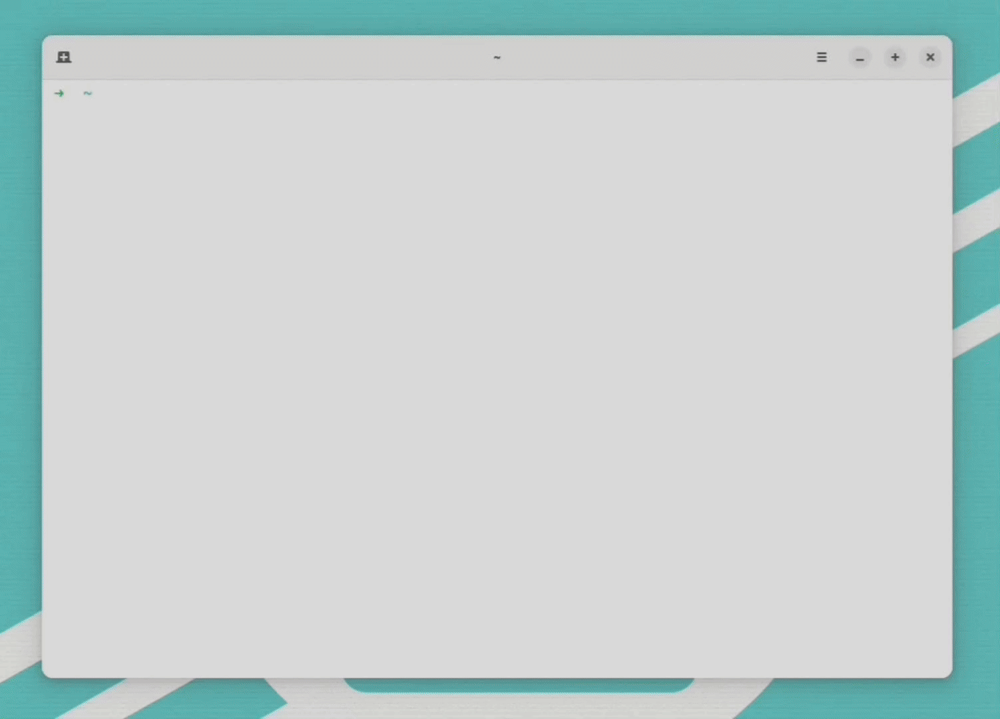

<h1 style="text-align:center">Curlify</h1>

<p>NOTE: I think TUI for api testing is not good solution. I thought I would use it heavily but I just went to curl for quick testing anyway. I have better plan for this, the one that I would use. I will try to build that when I have time.</p>


<p>

</p>
Curlify is a terminal-based API testing tool, designed to make it easier to test APIs with a clear and efficient terminal interface. It supports multiple panes for real-time input, HTTP methods, query/body parameters, and output display.

**Note:** Curlify is currently in beta and under active development. We are looking for open-source contributions to make it even better!

---

## Installation

You can install Curlify directly from the source using the `go install` command. Follow these steps:

### Prerequisites

- Ensure you have [Go](https://golang.org/doc/install) installed (version 1.18 or later).

### Steps to Install

1. Open your terminal.
2. Run the following command to install Curlify:

   ```bash
   go install github.com/codeshaine/curlify@latest
   ```

3. After installation, ensure your `$GOPATH/bin` or `$HOME/go/bin` is in your `PATH` environment variable.

---

## Usage

Once installed, you can use Curlify to test your APIs directly from the terminal:

```bash
curlify
```

Follow the on-screen instructions to interact with the tool.

### Keybindings

- `i`: Enter edit mode to modify the method, URL, or body.
- `h`: Focus on the header section in normal mode (it will go to edit mode in body section for writing headers).
- `esc`: Exit edit mode and return to normal mode.
- `j/k`: Navigate between method, URL, body, and result sections in normal mode.
- `g`: Make a request (when URL is provided) in normal mode.
- `q`: Quit the application.

---

## License

This project is licensed under the MIT License. See the [LICENSE](LICENSE) file for more details.


